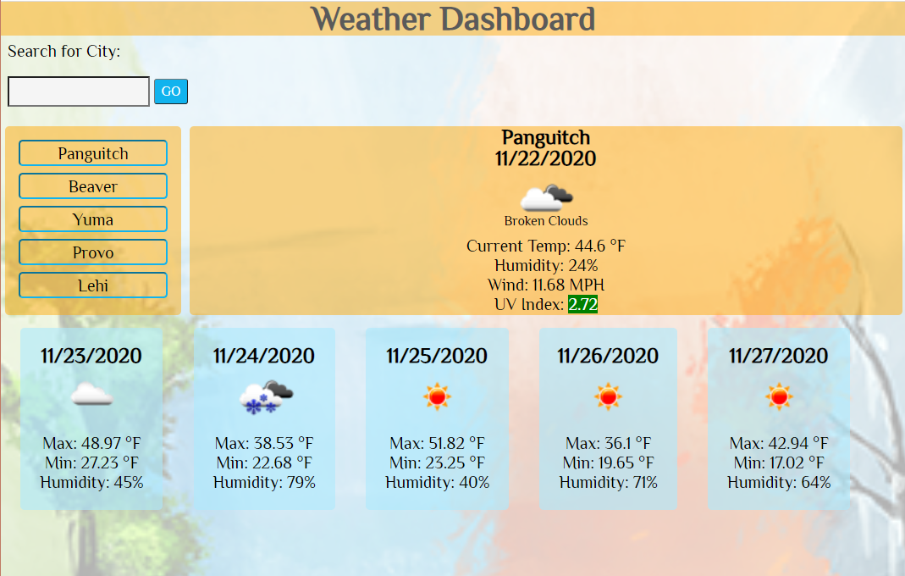

# Weather Dashboard

   

## Description

This application uses the OpenWeather API to display the current weather of a given location, as well as the 5 day forecast. It also utilizes Local Storage to save and retrieve previous searches.

Link to live site: [Weather Dashboard](https://clarissareeve.github.io/Weather_Dashboard/)

## Table of Contents

* [Contributing](#contributing)
* [License](#license)
* [Questions](#questions)

## License

MIT License

Copyright (c) 2020 Clarissa

## Contributing

When contributing to this repository, please first discuss the change you wish to make via issue, email, or any other method with the owner(s) of this repository before making a change.

## Questions

For any questions the author can be contacted at:

GitHub: @[clarissareeve](https://github.com/clarissareeve)

Email: clarissa.reeve@gmail.com
